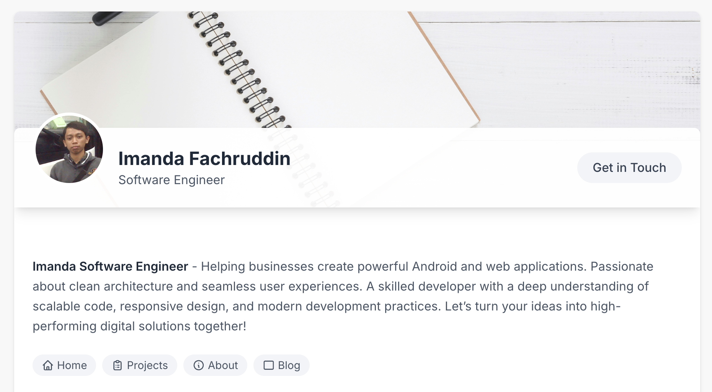

# Imanda Fachruddin – Portfolio Website

A clean, modern, and responsive personal portfolio website built with **HTML**, **Tailwind CSS**, and **Google Fonts**. This project showcases Imanda Fachruddin’s skills, projects, and writings as a **Software Engineer** experienced in Android and web application development.

## 🌟 Features

- 🎨 Stylish design with Tailwind CSS and custom styling
- 🧑‍💼 Personal introduction with avatar and professional bio
- 🧭 Navigation links (Home, Projects, About, Blog)
- 💼 Portfolio section with project cards and image thumbnails
- ✍️ Writing section for articles or blog posts
- 📱 Fully responsive layout
- 📷 Profile and cover image with clean layout
- 📦 Single HTML file (easy to host and modify)

## 🚀 Technologies Used

- **HTML5**
- **Tailwind CSS CDN**
- **Google Fonts (Inter)**
- **Responsive Layout & Flex/Grid**

## 📁 Project Structure

```

index.html        # Main HTML file with all content and styles

```

## 🧑‍💼 About the Author

**Imanda Fachruddin** – Helping businesses create powerful Android and web applications. Passionate about clean architecture and seamless user experiences. A skilled developer with a deep understanding of scalable code, responsive design, and modern development practices.

## 📸 Screenshots



